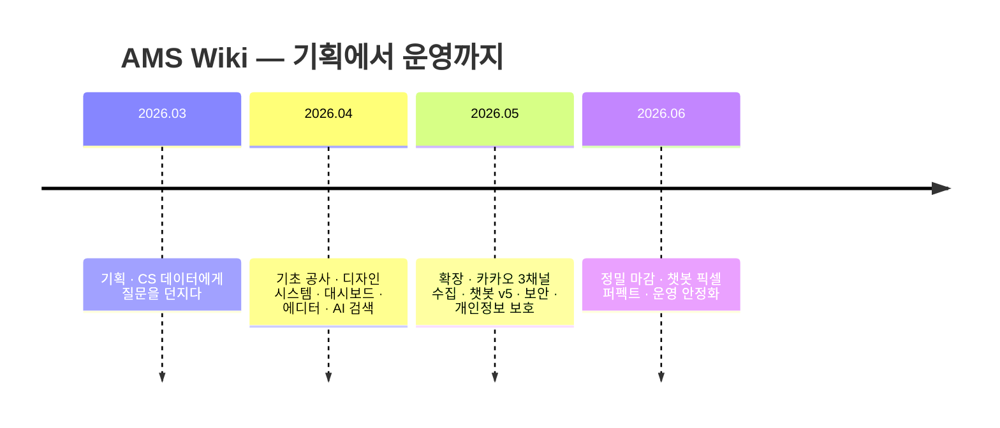
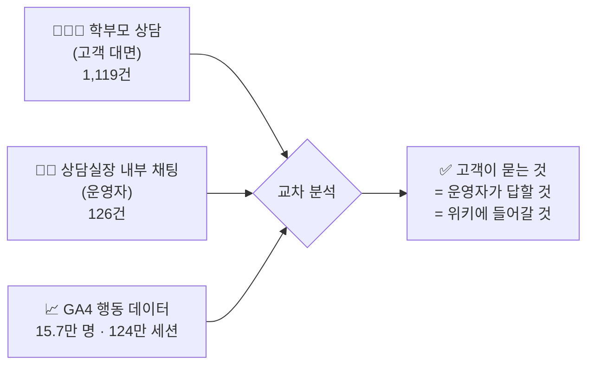
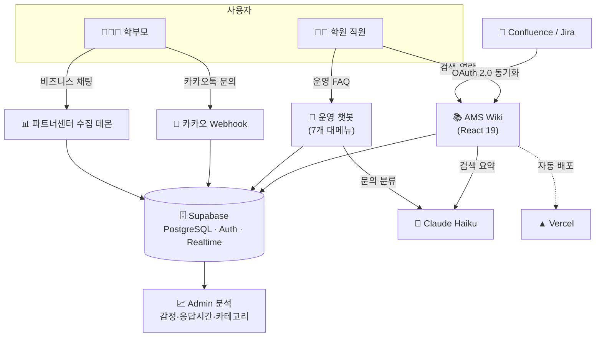

# 🌳 AMS Wiki 프로젝트 여정
### 흩어진 매뉴얼에서, 살아 있는 운영 플랫폼까지

> 한 학원의 *"매뉴얼은 있는데 아무도 못 찾는"* 문제가
> **데이터로 진단되고, 디자인으로 다듬어지고, 코드로 치료된** 3개월의 기록.
>
> 🔗 **라이브**: https://sdij-wiki.vercel.app

> 💬 *"세상에… 놀랍습니다. **기획·디자인·개발 영역까지 통달하신 결과물**, 잘 확인했습니다."*
> — **박미혜 실장**, 첫 공유 직후

---

## 📌 한눈에 보는 여정

### 숫자로 보는 결과물

| 지표 | 값 | 풀이 |
|---|---:|---|
| 📅 **여정 기간** | 약 3개월 | 데이터 분석 기획(3월) → 현재 운영(6월) |
| 💾 **코드 변경 횟수(커밋)** | **163회** | "저장 + 이유 메모"를 163번 남김 |
| 🔀 **반영 요청서(PR)** | **96건** | 검토 후 합쳐진 변경 묶음 96개 |
| 📄 **화면(페이지)** | 17개 | 사용자가 보는 페이지 수 |
| 🧩 **부품(컴포넌트)** | 54개 | 화면을 이루는 재사용 조각 |
| ✍️ **코드 분량** | 19,313줄 | — |
| 🗄️ **DB 설계도 갱신** | 15회 | 보관함 구조를 15번 정교화 |
| 🤝 **통합한 서비스** | 3개 | 위키 · 카카오 챗봇 · 상담 수집 |
| 📊 **분석한 상담 데이터** | **19,939건** | 무엇을 만들지 데이터로 결정 |

> 💡 **용어 풀이** — *커밋*(= 작업 저장 한 칸), *PR*(= Pull Request, 변경 반영 요청서),
> *컴포넌트*(= 버튼·카드처럼 재사용하는 화면 부품), *DB*(= 데이터 보관함).

---

## 🎬 프롤로그 — "매뉴얼은 있는데, 아무도 못 찾는다"

학원 운영에는 수백 가지 절차가 있습니다. 결제 환불, 출결 정정, 계정 이관, 영상 재생 오류…
문제는 **지식이 사람 머릿속과 흩어진 문서에만** 있었다는 것.

- 직원은 "이거 어떻게 처리하더라?"를 매번 옆자리에 물었고,
- 학부모 문의는 카카오톡으로 쏟아지는데 **누가·언제·무엇을** 답했는지 기록이 남지 않았으며,
- 같은 질문이 매일 반복돼도, **그게 얼마나 반복되는지조차** 아무도 몰랐습니다.

이 이야기는 그 혼돈을 **"검색하면 나오는 지식 + 스스로 답하는 챗봇 + 문의를 자동 수집·분석하는 시스템"** 으로 바꾼 여정입니다.

---

## 🧭 1막 · 기획 — "데이터에게 묻다"

> *"무엇을 먼저 만들 것인가? 감(感)이 아니라 숫자가 정하게 하자."*

대부분의 프로젝트는 "이게 필요할 것 같아"로 시작합니다. 이 프로젝트는 달랐습니다.
먼저 **3개월 치 상담 데이터를 통째로 분석**해, *진짜 문제*가 무엇인지부터 찾았습니다.

### 두 개의 채널, 하나의 진실

학부모가 *"학원등록 연동이 안 돼요"* 라고 상담하는 바로 그 시간, 상담실장은 내부 채팅에 *"이관 부탁드려요"* 를 올리고 있었습니다. **같은 문제의 양면**이었던 거죠. 이 둘을 겹쳐 보니 우선순위가 또렷해졌습니다.

### 분석이 드러낸 진짜 문제 (고객 상담 Top 4 = 전체의 63%)

| 순위 | 카테고리 | 비율 | 부정 감정 | 응답 중위수 |
|---:|---|---:|---:|---:|
| 1 | 영상재생/콘텐츠 | 23.1% | **17.4%** ← 최고 | 2.8분 |
| 2 | 학원등록 연동 | 15.2% | 9.4% | 3.0분 |
| 3 | QR/출석 | 12.5% | 13.6% | 3.9분 |
| 4 | 학부모/계정통합 | 12.4% | 8.6% | 3.2분 |

> 🔥 **충격적 발견** — 환불/결제 문의는 건수는 4위권인데 평균 응답이 **416분(약 7시간)**.
> 절차가 복잡하고 권한이 흩어져 있던 탓. → *"결제/환불 가이드를 가장 상세히 써야 한다"* 는 결론이 데이터에서 나왔습니다.

### 그리고, 효과는 미리 증명됐다

기획 단계에서 시범적으로 만든 **"회원 병합 가이드"** 하나가 배포되자,
관련 문의가 **하루 평균 3.1건 → 0.7건 (-77%)** 으로 떨어졌습니다.
이 한 줄의 데이터가 *"위키를 제대로 만들면 진짜로 일이 줄어든다"* 는 **프로젝트의 정당성**이 됐습니다.

📋 산출물: 1년 4단계 로드맵 · ICE 우선순위 7선 · 신규 가이드 11건 · 분석 데이터셋
*(→ `docs/ams-wiki-roadmap.md`, `docs/manager-inquiries-analysis.md`)*

---

## 🎨 2막 · 디자인 — "보이지 않는 것까지 설계하다"

> *"예쁜 게 아니라, 헤매지 않게 만드는 것."*

### 흔들리지 않는 뼈대 — 디자인 시스템

매번 색·여백·글꼴을 새로 정하면 화면마다 제각각이 됩니다. 그래서 먼저 **공통 규칙(디자인 시스템)** 을 깔았습니다.

- **shadcn/ui 표준 부품 28개** — 버튼·카드·표·모달을 한 가지 약속으로 통일
- **Pretendard 글꼴 · 다크 모드** — 낮에도 밤에도 눈이 편하게
- **Tailwind CSS 4** — 색과 간격을 *토큰*(= 이름 붙인 디자인 값)으로 관리해, 한 번 바꾸면 전체가 일관되게 따라옴

### 챗봇 — 세계 표준을 벤치마크하다

운영 챗봇은 "그냥 만든" 게 아니라, **글로벌 권위 5종의 원칙**을 그대로 적용했습니다.

| 벤치마크 | 핵심 원칙 | 우리 챗봇에 적용 |
|---|---|---|
| **Intercom Fin** | "답 못 하면 사람에게" 패턴 | 자동 의도 분석 + 사람 연결 fallback |
| **NN/G** (사용성 연구 425건) | 능력을 명확히 밝혀라 | "할 수 있는 것/없는 것" 박스 |
| **Google 대화 디자인** | 인지 부하 최소화, 4줄 이내 | 짧고 명확한 말풍선 |
| **Microsoft M365 Agents** | 카드형 + 빠른 답변 | 가이드 카드 + 추천 버튼 |
| **W3C WCAG 2.2** | 누구나 쓸 수 있게 | 키보드 조작 · 대비 **8.59:1 (AAA 최고 등급)** |

> 🎨 **브랜드 컬러** — 먹색 `#161616` + 포인트 블루 `#0043CE` (IBM Carbon 디자인 토큰).
> 흰 배경 위 파란 글씨 대비가 **8.59:1** — 시각 약자도 또렷이 읽는 최고 등급입니다.

### "시안과 1px도 다르지 않게"

6월 한 달은 **Figma 디자인 시안과 픽셀 단위로 맞추는** 정밀 마감의 연속이었습니다.
말풍선 색, 입력창 패널, 첨부 칩, 아이콘 선 스타일, 메시지 간격 8px… 수십 개의 "시안 일치" 작업이 이어졌고, **검색 추천목록의 경계선 하나**를 다듬는 데만도 다섯 번을 고쳐 끝내 *그라데이션 없는 또렷한 1px 선*에 도달했습니다. (← 바로 이번 마무리 작업)

---

## ⚙️ 3막 · 개발 — "코드로 현실이 되다"

> 세 개의 서비스가 하나의 보관함(Supabase) 위에서 맞물려 돌아갑니다.

### 전체 구조 한 장

### 세 개의 기둥

1. **📚 가이드 위키** — 6가지 유형(절차형 SOP · 판단분기 · 용어사전 · 트러블슈팅 · CS 스크립트 · 정책비교)으로 매뉴얼을 구조화. `⌘K` 명령 팔레트, 동의어 검색, 자동 목차.
2. **💬 운영 챗봇** — 7개 대메뉴 + 분류별 인기 FAQ + 자유 검색. **위키 가이드 100개**를 그대로 품고, 위키 FAQ 페이지와 *같은 데이터 원본*을 공유합니다.
3. **📨 카카오 수집·분석** — 학부모 문의(Webhook)와 비즈니스 채팅(수집 데몬)을 실시간으로 받아 자동 분류·적재하고, 감정·응답시간을 차트로 보여줍니다.

### 영리한 한 수 — AI 검색 요약

검색 결과 맨 위에, **Claude Haiku가 요점을 3줄로 요약**해 줍니다. 같은 질문에는 *프롬프트 캐싱*(= 반복 입력을 재사용해 비용·속도 절약)으로 빠르고 저렴하게 응답합니다.

### 위기, 그리고 돌파 (개발은 늘 순탄하지 않았다)

| ⚡ 위기 | 🛠️ 돌파 |
|---|---|
| 실시간 수집(STOMP 방식)이 작동하지 않음 | **증분 폴링 방식으로 전환** — 변경된 채팅의 최신 페이지를 주기적으로 재수집 |
| Vercel 서버 함수 **12개 한도 초과**로 배포 실패 | 중복 기능 제거(`api/faq.js`)로 한도 내 정리 |
| 수집 쿠키가 만료되면 데이터가 멈춤 | **쿠키 자가 복구** — 만료를 감지해 스스로 갱신, 멈춤·폭주 방지 |

---

## 🛡️ 4막 · 유지보수 — "살아 있는 시스템을 갈고닦다"

> 완성은 끝이 아니라 시작. 운영은 매일 손이 갑니다.

### 개인정보를 지키는 일 (가장 진지하게)

학부모 채팅에는 이름·연락처 같은 민감정보가 섞입니다. 그래서:

- **PII 마스킹 파이프라인** — 수집·적재·표시 전 단계에서 개인정보를 자동 가림
- **RLS**(= Row Level Security, *누가 어떤 데이터 행을 볼 수 있는지* 정하는 보관함 잠금장치) — 비로그인 열람을 막고 **로그인 사용자 전용**으로 전환해 고객 정보를 보호
- Supabase **보안 권고(advisor)** 지적사항을 그때그때 반영

### 자동화된 품질 관문

- **GitHub Actions** — 코드가 합쳐질 때마다 자동으로 검사(`ci`)·보안 스캔(`codeql`)·배포(`deploy`)
- **Dependabot** — 외부 부품의 보안 업데이트를 자동 제안
- 모든 변경은 **PR(반영 요청서) → 검토 → 합치면 가지 자동 삭제** 흐름으로 깔끔하게 관리

### 끝없는 디테일 — "1px의 장인정신"

가장 최근 작업은 챗봇 **검색 추천목록의 경계선** 하나였습니다.
그림자가 안개처럼 번져 보인다는 피드백에 → 그림자를 줄이고 → 그라데이션을 없애고 → 끝내 *모서리에서 끊기지 않는 평평한 1px 실선*으로 마무리했습니다.
**눈에 거의 안 보이는 선 하나에도 다섯 번의 손길**이 들어간다는 것 — 이 프로젝트가 품질을 다루는 방식입니다.

---

## 📣 클라이맥스 · 현장에 닿다 — 공유, 그리고 반응

> *조용히 만들어 온 결과물이, 처음으로 사람들 앞에 놓인 순간.*

### 5월 21일, 첫 공유

화려한 발표가 아니라 **있는 그대로의 보고**였습니다. 받는 사람이 곧바로 써볼 수 있도록 — 접속 주소·로그인·데이터 흐름까지 한 번에.

> 📨 **공유 메시지 (요약)**
> *"카카오 상담 대시보드 공유드립니다. 파트너센터 **3채널(마이클래스 / LIVE / C)** 상담 내역을 한 곳에서 **조회·검색·내보내기** 할 수 있습니다. 상시 데몬이 **60초마다 신규/변경분만 증분 수집**해 거의 실시간으로 반영됩니다 — `파트너센터 API → Supabase(로그인 사용자만 읽기·RLS 적용) → 대시보드`. 초기 버전이라 미흡할 수 있으니, 쓰시면서 에러나 개선사항 편히 공유 부탁드립니다."*

### 돌아온 반응

👍 ❤️ 👏 — 그리고 박미혜 실장의 메시지가 도착했습니다.

> 💬 **박미혜 실장**
> *"세상에… 놀랍습니다. **기획·디자인·개발 영역까지 통달하신 결과물**, 잘 확인했습니다 🙏"*
>
> *"이런 놀라운 걸 만들고 계셨던 거였군요. 며칠간의 그 시간이, 사실은 이렇게 깊이 몰두해 결과물을 만들어내고 계셨던 거였더라고요. 묵묵히 이렇게까지 완성해 주신 결과물에 **진심으로 감사드립니다.**"*

며칠간 묵묵히 이어 온 몰입이, 마침내 **눈에 보이는 결과물로 증명되는** 순간이었습니다.

### 가장 값진 한마디

이튿날, 실장은 이 프로젝트의 진짜 의미를 짚었습니다.

> 💬 *"명준님의 **몰입과 AI 결과물을 직원들이 배워야겠어요.** 조만간 정리해서 리뷰 좀 부탁드립니다."*

> 📌 **그리고 — 지금 읽고 계신 이 문서가, 바로 그 '리뷰'입니다.**
> 한 사람의 몰입과 AI 협업이 어떻게 *기획 → 디자인 → 개발 → 유지보수* 의 전 과정을 통과해 하나의 운영 플랫폼이 되었는지, 누구나 따라 읽을 수 있도록 남긴 기록.

---

## 🌅 에필로그 — 지금, 그리고 다음

오늘 `sdij-wiki.vercel.app` 에서는:

- ✅ 직원이 **검색 한 번**으로 운영 절차를 찾고,
- ✅ 챗봇이 **7개 메뉴 · 가이드 100개**로 스스로 답하며,
- ✅ 학부모 문의가 **실시간으로 수집·분류·분석**되고,
- ✅ 모든 변경이 **자동 검사·배포**로 안전하게 반영됩니다.

> *"아무도 못 찾던 매뉴얼"* 은 이제 **검색하면 나오고, 물으면 답하고, 쌓일수록 똑똑해지는** 플랫폼이 됐습니다.

**다음 장(章)은** — 챗봇 로드맵 ②위키 RAG → ③게시판 자동등록 → ④자연어 DB 질의로 이어집니다.
이야기는 아직 끝나지 않았습니다. 🌳

---

### 📚 더 깊이 보고 싶다면

| 관심사 | 문서 |
|---|---|
| 전체 개요·실행법 | [`README.md`](../README.md) |
| 왜·무엇을 만들었나(기획) | [`docs/ams-wiki-roadmap.md`](./ams-wiki-roadmap.md) |
| 챗봇 설계 원리 | [`docs/chatbot-design.md`](./chatbot-design.md) |
| 서비스 기능 명세 | [`docs/AMS_Wiki_서비스기능정의서.md`](./AMS_Wiki_서비스기능정의서.md) |
| 디자인 시스템 | [`docs/shadcn-ui/`](./shadcn-ui/README.md) |

이 문서는 프로젝트의 실제 커밋 163개 · PR 96건 · 분석 데이터를 근거로 작성된 여정 기록입니다.
